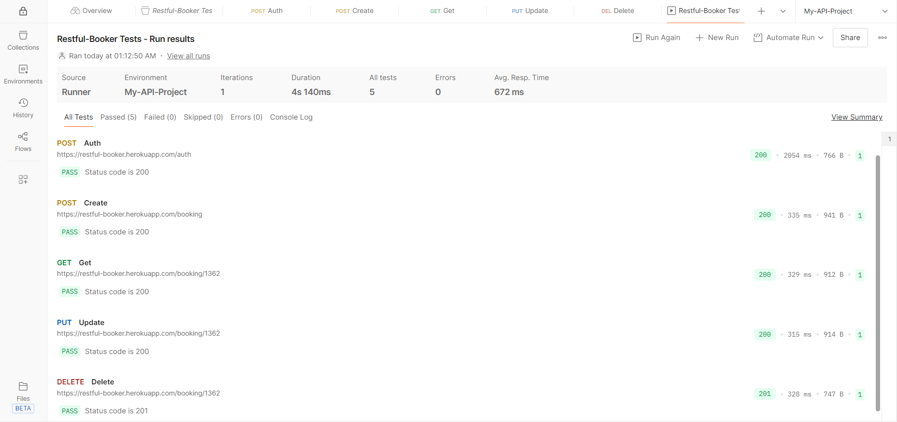

# Restful-Booker End-to-End API Automation (Postman)

## 📌 Project Overview
This project demonstrates end-to-end API testing of the Restful-Booker application using Postman.  
The complete CRUD workflow is automated using dynamic environment variables and JavaScript test scripts.

---

## 🔄 Test Workflow

1. **Auth** – Generate authentication token  
2. **Create Booking** – Create a new booking  
3. **Get Booking** – Retrieve created booking details  
4. **Update Booking** – Update booking information  
5. **Delete Booking** – Delete the booking  

All requests are executed sequentially using Postman Collection Runner.

---

## 🛠 Tools & Technologies

- Postman
- JavaScript (Postman Test Scripts)
- Collection Runner
- Environment Variables

---

## ⚙️ Key Features

- Dynamic handling of `bookingId`
- Dynamic authentication token management
- Automated status code validation
- End-to-End CRUD flow validation
- Environment-based execution

---

## 🚀 How to Run the Project

1. Import the Postman Collection file  
2. Import the Environment file  
3. Select the environment  
4. Run the collection using Collection Runner  

---

## 📊 Test Run Results

All API requests executed successfully.

---

